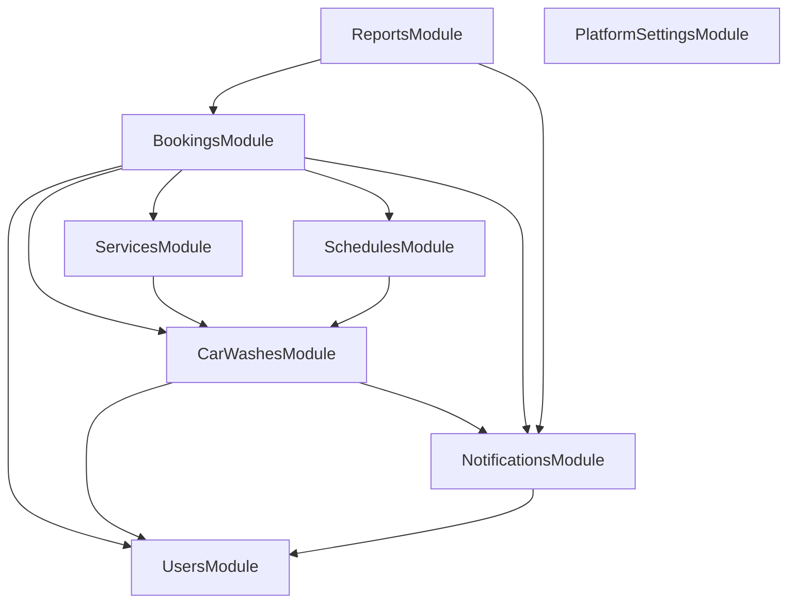

# Diseño de Módulos y Entidades en NestJS (LavaApp)

Este documento detalla la arquitectura modular del backend NestJS para la Tarea 1.1.1. Define las responsabilidades de cada módulo, sus entidades, y la hoja de ruta de implementación módulo por módulo para garantizar un desarrollo seguro, incremental y libre de dependencias circulares.

---

## 1. Arquitectura de Módulos y Entidades

Para evitar que el módulo de autenticación (`AuthModule`) se sobrecargue con lógica de negocio y para mantener una separación clara de dominios, el backend se dividirá en los siguientes módulos:

---

## 2. Detalle de Módulos y Responsabilidades

### A. Módulos Existentes
1. **`UsersModule`**
   * **Entidad:** `User`
   * **Responsabilidad:** Registro, perfiles y listado de usuarios del Superadmin.
2. **`AuthModule`**
   * **Entidad:** `RevokedToken`
   * **Responsabilidad:** Autenticación (JWT), validación y revocación de sesiones (logout).

### B. Nuevos Módulos a Crear de Forma Incremental
3. **`NotificationsModule`**
   * **Entidad:** `Notification`
   * **Responsabilidad:** Registro de notificaciones de la campanita y envío reactivo.
4. **`PlatformSettingsModule`**
   * **Entidad:** `PlatformSettings`
   * **Responsabilidad:** Gestión de precios globales de membresía y CBU del Superadmin.
5. **`CarWashesModule`**
   * **Entidades:** `CarWash`, `CarWashBay`, `AdminSubscription`
   * **Responsabilidad:** Gestión comercial de lavaderos, cantidad y estado de bahías, e historial de membresías.
6. **`ServicesModule`**
   * **Entidad:** `Service`
   * **Responsabilidad:** Catálogo de tipos de lavado, precios y duraciones del servicio.
7. **`SchedulesModule`**
   * **Entidades:** `Schedule`, `ScheduleException`
   * **Responsabilidad:** Horarios semanales flexibles y excepciones del calendario (cierres/feriados).
8. **`BookingsModule`**
   * **Entidad:** `Booking`
   * **Responsabilidad:** Reservas de clientes, bloqueo transitorio de 10 min, cálculo de disponibilidad crítica.
9. **`ReportsModule`**
   * **Entidad:** `Report`
   * **Responsabilidad:** Registro y resolución de reportes de disputas de clientes.

---

## 3. Hoja de Ruta de Implementación Módulo por Módulo

Para prevenir errores, implementaremos y probaremos los módulos secuencialmente en el siguiente orden. Cada paso incluye la generación del módulo, la entidad y la prueba de compilación del servidor.

### Paso 1: `NotificationsModule` (Campanita)
* **Entidad:** `Notification`
* **Dependencias:** `UsersModule` (para la relación con `User`).
* **Prueba:** Generar el módulo y comprobar que compile con el servidor NestJS.

### Paso 2: `PlatformSettingsModule` (Configuración Global)
* **Entidad:** `PlatformSettings`
* **Dependencias:** Ninguna.
* **Prueba:** Compilar y comprobar la base de datos SQLite.

### Paso 3: `CarWashesModule` (Negocio, Bahías y Membresías)
* **Entidades:** `CarWash`, `CarWashBay`, `AdminSubscription`
* **Dependencias:** `UsersModule` (relación 1:1 con User `admin`) y `NotificationsModule`.
* **Prueba:** Compilar y validar relaciones en base de datos.

### Paso 4: `ServicesModule` (Servicios del Lavadero)
* **Entidad:** `Service`
* **Dependencias:** `CarWashesModule` (relación N:1 con CarWash).
* **Prueba:** Compilar y probar.

### Paso 5: `SchedulesModule` (Calendario y Horarios)
* **Entidades:** `Schedule`, `ScheduleException`
* **Dependencias:** `CarWashesModule` (relación N:1 con CarWash).
* **Prueba:** Compilar y probar.

### Paso 6: `BookingsModule` (Reservas y Disponibilidad)
* **Entidad:** `Booking`
* **Dependencias:** `UsersModule`, `CarWashesModule` (y `CarWashBay`), `ServicesModule`, `SchedulesModule`, `NotificationsModule`.
* **Prueba:** Compilar y probar.

### Paso 7: `ReportsModule` (Arbitraje de Disputas)
* **Entidad:** `Report`
* **Dependencias:** `BookingsModule`, `NotificationsModule`.
* **Prueba:** Compilar y probar todo el conjunto final.
