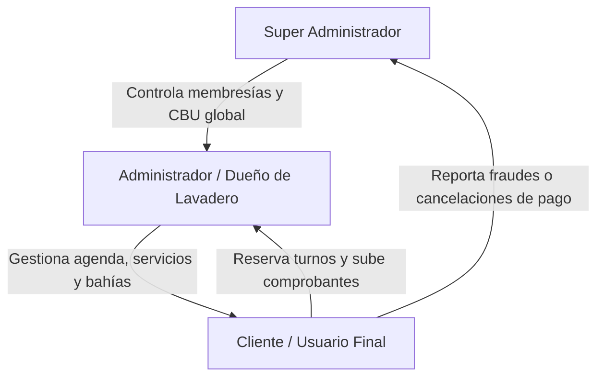
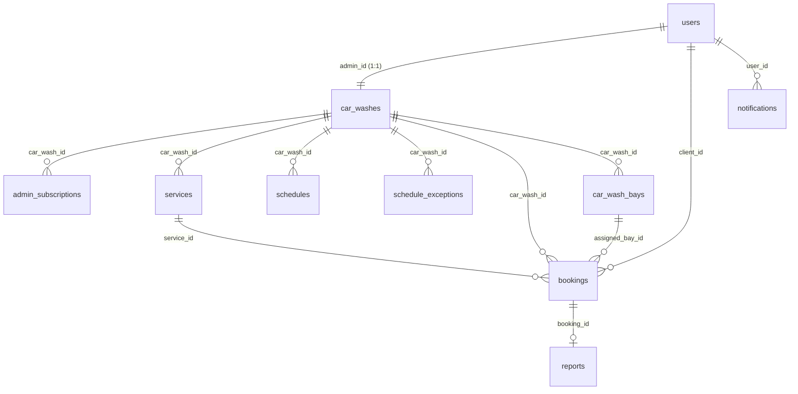
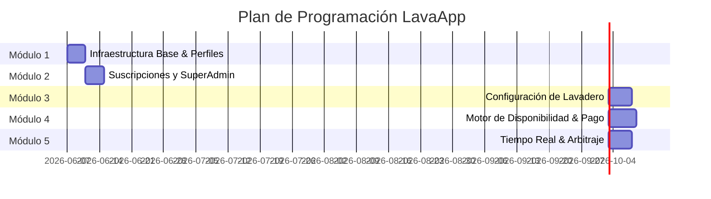

# Enciclopedia de Diseño y Arquitectura del Sistema: LavaApp
## Plataforma SaaS & Marketplace de Reserva de Turnos para Lavaderos de Autos

Este documento unifica, amplía y analiza de forma crítica la información extraída del **Manual Funcional** y de la **Especificación Técnica** del sistema. Sirve como la guía definitiva de diseño y como plan de implementación modular para continuar el desarrollo del proyecto de forma robusta, segura y consistente con lo que ya está construido.

---

## 1. Visión General y Motivo del Sistema

LavaApp nace para digitalizar y centralizar el proceso de reserva de turnos en lavaderos de vehículos, eliminando la informalidad del orden de llegada o de mensajes de mensajería (WhatsApp), los cuales generan demoras para clientes y tiempos muertos para los negocios.

El sistema funciona bajo un modelo dual de **Marketplace** y **SaaS (Software as a Service)**:
1. **Marketplace:** Los clientes buscan lavaderos cercanos, comparan servicios, precios y reservan turnos en tiempo real.
2. **SaaS:** Los dueños de lavaderos pagan una membresía mensual al operador de la plataforma para mantener su negocio visible en el mapa y acceder a las herramientas avanzadas de administración de su agenda y bahías físicas de lavado.

---

## 2. Los Roles del Sistema (Personajes)

El ecosistema está impulsado por la interacción de tres roles principales:

### A. Cliente (Usuario Final)
* **Quién es:** Dueño de vehículos que requiere un servicio de lavado programado o inmediato sin esperas.
* **Flujo principal:**
  1. Busca lavaderos activos en un mapa interactivo (filtrando por fecha e inmediación).
  2. Selecciona un horario disponible y un tipo de servicio (auto, moto, camioneta).
  3. Realiza la pre-reserva (el turno se congela por 10 minutos).
  4. Transfiere el dinero al alias/CBU directo del lavadero y sube la captura del comprobante.
  5. Monitorea el estado de su reserva ("Pendiente", "Aprobado", "Rechazado") en su panel personal.

### B. Administrador (Dueño del Lavadero)
* **Quién es:** El propietario o encargado del establecimiento físico de lavado.
* **Flujo principal:**
  1. Se registra en la aplicación (su cuenta entra en estado inactivo hasta pagar la membresía).
  2. Accede a la pantalla de pago de suscripción para ver los datos del Superadmin y cargar el comprobante.
  3. Una vez habilitado, parametriza su negocio: cantidad de bahías, ubicación en el mapa, alias de cobro, catálogo de servicios, horarios de atención y feriados.
  4. Gestiona la agenda diaria/semanal: aprueba o rechaza reservas entrantes validando las capturas de pago.
  5. Monitorea y fuerza manualmente el estado de las bahías en tiempo real si hay variaciones operativas.
  6. Utiliza el "Botón de Pánico" para cerrar temporalmente el local de la vista del mapa si hay imprevistos.

### C. Super Administrador (Operador de la Plataforma)
* **Quién es:** El dueño y administrador del software.
* **Flujo principal:**
  1. Define las configuraciones globales (precio de la membresía y alias/CBU de cobro de la plataforma).
  2. Valida los comprobantes de pago de suscripción de los lavaderos para activarlos por periodos de 30 días.
  3. Arbitra disputas entre clientes y lavaderos a través del sistema de reportes (pudiendo suspender lavaderos que rechacen turnos sin devolver el dinero).

---

## 3. Modelo de Datos y Entidades

Esquema relacional unificado adaptado para **TypeORM (SQLite/PostgreSQL)**:

### Detalle de las Tablas

#### 1. `users`
Almacena credenciales de acceso global y el rol del usuario.
* `id`: UUID (Primary Key)
* `email`: VARCHAR(255) (Unique, Not Null)
* `password_hash`: VARCHAR(255) (Not Null)
* `role`: ENUM ('super_admin', 'admin', 'client') (Not Null)
* `created_at`: TIMESTAMP (Default NOW())

#### 2. `platform_settings`
Configuración global gestionada únicamente por el Superadmin. (Fila única con ID = 1).
* `id`: INT (Primary Key, default = 1)
* `superadmin_alias`: VARCHAR(100) (Alias CBU/CVU de la plataforma)
* `subscription_price`: DECIMAL(10,2) (Costo mensual de membresía)
* `updated_at`: TIMESTAMP

#### 3. `car_washes`
Información central de cada establecimiento comercial.
* `id`: UUID (Primary Key)
* `admin_id`: UUID (Foreign Key -> `users.id`, Relación 1:1)
* `name`: VARCHAR(150) (Nombre del lavadero)
* `latitude`: DECIMAL(10,8) (Coordenada geográfica)
* `longitude`: DECIMAL(11,8) (Coordenada geográfica)
* `bays_count`: INT (Cantidad de bahías de lavado físico simultáneo. Default = 1)
* `client_payment_alias`: VARCHAR(100) (Alias CBU/CVU propio del lavadero para cobro a clientes)
* `is_manually_open`: BOOLEAN (Default true. Control manual "Abierto/Cerrado")
* `is_active`: BOOLEAN (Default false. Estado de suscripción/suspensión controlado por Superadmin)
* `subscription_expires_at`: TIMESTAMP (Nullable. Fin de vigencia del lavadero en el mapa)

#### 3b. `car_wash_bays`
Espacios físicos individuales de lavado dentro de cada lavadero.
* `id`: UUID (Primary Key)
* `car_wash_id`: UUID (Foreign Key -> `car_washes.id`)
* `bay_number`: INT (Número de bahía en el lavadero, ej: 1, 2, 3)
* `status`: ENUM ('free', 'occupied', 'blocked') (Default 'free'. Control de disponibilidad y estado en tiempo real)
* `current_booking_id`: UUID (Foreign Key -> `bookings.id`, Nullable. Reserva que ocupa actualmente esta bahía)

#### 4. `admin_subscriptions`
Historial de comprobantes de pago de membresías cargados por administradores.
* `id`: UUID (Primary Key)
* `car_wash_id`: UUID (Foreign Key -> `car_washes.id`)
* `receipt_url`: TEXT (Ruta de la imagen de transferencia)
* `status`: ENUM ('pending', 'approved', 'rejected') (Default 'pending')
* `amount_paid`: DECIMAL(10,2) (Monto abonado al momento del pago)
* `created_at`: TIMESTAMP (Default NOW())

#### 5. `services`
Tipos de lavado ofrecidos de forma personalizada por cada establecimiento.
* `id`: UUID (Primary Key)
* `car_wash_id`: UUID (Foreign Key -> `car_washes.id`)
* `name`: VARCHAR(100) (Ej: "Lavado Premium Completo")
* `description`: TEXT (Detalles del servicio)
* `vehicle_type`: VARCHAR(50) (Ej: 'moto', 'auto', 'camioneta')
* `duration_minutes`: INT (Restringido a múltiplos de 15: 60, 90, 120, etc.)
* `price`: DECIMAL(10,2)

#### 6. `schedules`
Matriz de horarios de apertura regulares semanales con intervalos flexibles.
* `id`: UUID (Primary Key)
* `car_wash_id`: UUID (Foreign Key -> `car_washes.id`)
* `day_of_week`: INT (0 = Domingo, 6 = Sábado)
* `start_time`: TIME (Not Null. Hora de apertura del intervalo)
* `end_time`: TIME (Not Null. Hora de cierre del intervalo)

#### 7. `schedule_exceptions`
Bloqueos de fechas específicas (feriados, emergencias, etc.) que anulan la agenda regular.
* `id`: UUID (Primary Key)
* `car_wash_id`: UUID (Foreign Key -> `car_washes.id`)
* `date`: DATE (Fecha específica bloqueada)
* `reason`: TEXT

#### 8. `bookings`
Gestión transaccional y de concurrencia de reservas de clientes.
* `id`: UUID (Primary Key)
* `client_id`: UUID (Foreign Key -> `users.id`)
* `car_wash_id`: UUID (Foreign Key -> `car_washes.id`)
* `service_id`: UUID (Foreign Key -> `services.id`)
* `assigned_bay_id`: UUID (Foreign Key -> `car_wash_bays.id`, Nullable)
* `date_time`: TIMESTAMP (Inicio del turno)
* `end_time`: TIMESTAMP (Calculado automáticamente: `date_time` + `service.duration_minutes`)
* `receipt_url`: TEXT (Nullable. Comprobante de pago del cliente)
* `status`: ENUM ('temporary_locked', 'pending_approval', 'approved', 'rejected', 'cancelled')
* `locked_until`: TIMESTAMP (Fecha límite del bloqueo preventivo de 10 minutos)

#### 9. `reports`
Denuncias de clientes sobre cobros injustificados o rechazos de turnos confirmados.
* `id`: UUID (Primary Key)
* `booking_id`: UUID (Foreign Key -> `bookings.id`)
* `client_id`: UUID (Foreign Key -> `users.id`)
* `car_wash_id`: UUID (Foreign Key -> `car_washes.id`)
* `receipt_screenshot_url`: TEXT (Prueba de transferencia válida)
* `status`: ENUM ('open', 'under_review', 'resolved') (Default 'open')
* `resolution_notes`: TEXT

#### 10. `notifications`
Tabla reactiva para el sistema de alertas de la campanita.
* `id`: UUID (Primary Key)
* `user_id`: UUID (Foreign Key -> `users.id`)
* `title`: VARCHAR(100) (Ej: "Turno Aprobado")
* `message`: TEXT
* `is_read`: BOOLEAN (Default false)
* `created_at`: TIMESTAMP (Default NOW())

---

## 4. Matriz de Decisiones Técnicas y de Diseño (Especificaciones PDF)

Esta sección consolida los dilemas operativos, las consultas analíticas del proceso de diseño y las especificaciones de comportamiento del sistema contempladas en la especificación técnica original:

### Consulta 1: Control de Concurrencia y Colisiones (Race Conditions)
* **Problema:** ¿Qué sucede si dos clientes visualizan y seleccionan el mismo horario simultáneamente para un lavadero con capacidad crítica (ej. 1 sola bahía restante)?
* **Resolución del Sistema:** El sistema implementará un bloqueo preventivo e inmediato en el instante exacto en que un cliente selecciona el turno e ingresa a la interfaz de pago (antes de subir el comprobante). El turno quedará retenido de forma exclusiva para ese cliente durante un tiempo límite de 10 minutos. Si el cliente sube el comprobante dentro de este lapso, el turno se consolida en estado "Pendiente de Aprobación" y se anula el límite de tiempo. Si el temporizador expira sin acción por parte del cliente, el sistema libera automáticamente el bloque horario para que esté visible en el buscador.

### Consulta 2: Lógica de Capacidad Simultánea y Duración de Servicios
* **Problema:** ¿Cómo se determina la disponibilidad y cómo conviven la duración variable de los servicios con la infraestructura del lavadero?
* **Resolución del Sistema:** La capacidad estará determinada por la configuración de la "Cantidad de Bahías" (puestos de lavado simultáneos) del negocio. El tiempo de la agenda se segmenta en bloques mínimos de 15 minutos. Los servicios tendrán duraciones dinámicas que obligatoriamente deben ser múltiplos de 15 minutos (ej. 60, 90, 120 minutos). Un horario solo se considera "bloqueado" en el buscador para un cliente cuando la cantidad de turnos (aprobados o temporalmente reservados) es igual a la cantidad total de bahías configuradas para ese rango horario.

### Consulta 3: Automatización de Estados en Tiempo Real para las Bahías
* **Problema:** ¿Deben las bahías reflejar la ocupación de forma manual o automatizada en el panel de control?
* **Resolución del Sistema:** Al iniciar el rango de tiempo de un turno aprobado, el sistema cambiará automáticamente el estado de la bahía correspondiente a "Ocupado". No obstante, para gestionar la variabilidad del mundo real (clientes que no se presentan o servicios que finalizan antes), el Administrador dispondrá de un control manual táctil/clic para desmarcar o forzar el estado de cada bahía en tiempo real. Este cambio se sincronizará instantáneamente con las pantallas de los clientes.

### Consulta 4: Flujo ante Rechazos de Pago y Cancelaciones
* **Problema:** ¿Qué mecanismos de protección y reglas operan si un turno aprobado se cancela o si un pago es rechazado?
* **Resolución del Sistema:**
  * Si el Administrador rechaza un pago de forma injustificada, el cliente tiene la facultad de emitir un reporte formal adjuntando la captura de la transferencia efectuada. El Superadmin auditará este reporte y podrá aplicar multas o suspender el lavadero.
  * Si la cancelación la realiza el Cliente tras haber sido aprobado el turno, no hay obligación de reembolso por defecto; sin embargo, el Administrador tendrá herramientas para borrar el turno y devolver el dinero voluntariamente, reasignar el horario, o solicitar una reasignación acordada. El sistema advertirá explícitamente al cliente sobre cancelaciones sobre la hora.

### Consulta 5: Ciclo de Vida de la Suscripción y Suspensiones del Negocio
* **Problema:** ¿Qué ocurre exactamente cuando expira el pago mensual que realiza el administrador al superadministrador?
* **Resolución del Sistema:** El sistema enviará notificaciones de advertencia al administrador con 5 días de anticipación y de forma sucesiva diaria. Al expirar el plazo, el dashboard del administrador se bloquea inmediatamente, revirtiendo a la vista restrictiva de "Pendiente" (donde solo visualiza el alias del superadmin, el monto y el formulario de carga de comprobante) sin borrar sus datos configurados. Simultáneamente, el lavadero se oculta por completo del buscador de inicio y se le impide recibir cualquier reserva. Al registrarse un pago anticipado dentro de los 5 días previos, los nuevos 30 días se adicionan al vencimiento original, evitando pérdidas de días de servicio.

---

## 5. Análisis Crítico y Propuestas de Mejora del Agente (Evolución de Arquitectura)

Al analizar la dinámica funcional e interactiva del sistema como un prototipo, surgen los siguientes vacíos y oportunidades de mejora técnica:

### 1. El Vacío de la Persistencia de Bahías en Tiempo Real (Tabla Relacional vs JSON)
* **Problema:** La especificación funcional indica que el administrador puede alternar manualmente el estado de cada bahía a "Libre"/"Ocupado", y que el sistema cambia automáticamente una bahía al iniciar un turno aprobado. En el esquema original no había tablas para bahías individuales.
* **Propuesta de Solución Adoptada:** Para evitar problemas de concurrencia y desnormalización de datos, crearemos una tabla relacional independiente llamada `car_wash_bays`. Cada lavadero tendrá asociadas tantas filas en esta tabla como indique su `bays_count`. Esto permite registrar y persistir limpiamente el estado en tiempo real de cada bahía (incluyendo anulaciones manuales de administrador) y asociarla directamente a reservas activas, persistiendo tras reinicios del servidor.

### 2. Mapeo de Reservas a Bahías Físicas Específicas
* **Problema:** Cuando se inician múltiples turnos concurrentes en un lavadero, el backend necesita saber exactamente qué auto y qué reserva ocupan cada bahía física individual para evitar solapamientos y permitir cancelaciones o liberaciones precisas.
* **Propuesta de Solución Adoptada:** Añadir la columna `assigned_bay_id` en la tabla `bookings`, referenciando la tabla `car_wash_bays`. Al aprobarse una reserva o al dar inicio, el backend le asignará de manera automática y transaccional una bahía disponible de la lista.

### 3. Consistencia de Roles y Nomenclatura del Código
* **Problema:** Los documentos de análisis usan indistintamente `superadmin`, `cliente`, `super_admin` o `client`.
* **Propuesta de Solución Adoptada:** Homologar todo estrictamente según la base de código ya existente y operativa: `super_admin` y `client` en inglés y con guion bajo, y `admin`.

### 4. Automatización de Inicio/Fin de Turnos (Optimización de Recursos)
* **Problema:** Al iniciar un turno se debe actualizar el estado de la bahía a "Ocupada", y al finalizar se debe liberar. Hacer consultas en tiempo real por cada segundo consumiría demasiados recursos.
* **Propuesta de Solución Adoptada:** Configurar un Cronjob ligero en NestJS que se ejecuta cada 15 minutos (coincidiendo con el tamaño del bloque mínimo de servicios). Este proceso automatizado buscará reservas aprobadas cuya hora de inicio o fin coincida con el bloque actual y actualizará el estado de la bahía asociada en `car_wash_bays`. Esta consulta es sumamente liviana (una simple actualización SQL indexada) y consume prácticamente cero recursos.

### 5. Expiración de Turnos con Bloqueo de 10 minutos (Concurrencia sin Cron Job activo)
* **Problema:** Si dependemos de un Cronjob para cambiar el estado de reservas expiradas de `temporary_locked` a `cancelled`, habría un retardo molesto (de minutos) para liberar turnos que los usuarios abandonaron a mitad del flujo de pago.
* **Propuesta de Solución Adoptada:**
  * **Dos fases claras del bloqueo:**
    1. **Pre-reserva activa (Fase 1):** El turno se crea en `bookings` con estado `temporary_locked` y `locked_until = NOW() + 10 minutos`.
    2. **Envío de comprobante (Fase 2):** Al subir cualquier comprobante de pago, el estado cambia a `pending_approval` y el temporizador de 10 minutos **deja de regir**. El bloqueo de concurrencia ahora es indefinido y se mantiene hasta que el administrador presione "Aprobar" o "Rechazar".
  * **Concurrencia dinámica (Zero-Cron para disponibilidad):** El backend, al calcular los bloques disponibles, ignorará las pre-reservas con `temporary_locked` cuyo `locked_until` esté en el pasado (`locked_until < NOW()`). Así, la liberación del turno ante inactividad es **inmediata y en tiempo real** en las consultas de otros clientes, sin requerir una tarea en segundo plano que altere el estado en el instante exacto. Los Cronjobs sólo se utilizarán para la limpieza offline periódica de registros basura acumulados.

### 6. Estructura Flexible de Horarios de Atención
* **Problema:** El diseño original forzaba al lavadero a configurar únicamente dos turnos con columnas fijas (`shift_1_start`, `shift_2_start`), lo cual es una limitación severa que no escala ante horarios continuos o esquemas de más de dos intervalos.
* **Propuesta de Solución Adoptada:** Estructurar la tabla `schedules` de forma puramente relacional. En lugar de columnas fijas para turnos, cada fila en `schedules` representará un intervalo de atención con `start_time` y `end_time` para un `day_of_week`. Si un lavadero abre de forma cortada (ej. mañana y tarde), se insertarán **dos registros** para ese día. Si abre horario corrido, se insertará **un solo registro**. Esto brinda flexibilidad ilimitada de horarios por lavadero.

### 7. Decisión de Infraestructura: WebSockets Locales vs Supabase Realtime
* **Problema:** La especificación sugiere usar "Supabase Realtime" para empujar cambios. Sin embargo, nuestro backend actual corre autocontenido en NestJS con SQLite y TypeORM localmente en Termux. Nos preguntamos si esto funciona en producción y si afectará una migración futura a Supabase en la nube.
* **Propuesta de Solución Adoptada:**
  * **En Producción:** El stack actual (SQLite + TypeORM) funciona perfectamente para desarrollo y producción inicial. Sin embargo, TypeORM nos brinda independencia del motor de base de datos. Si en el futuro decides migrar a Supabase (que usa PostgreSQL), solo deberás cambiar el driver en la configuración de TypeORM (de `sqlite` a `postgres`). Todo el código de entidades y lógica seguirá funcionando exactamente igual sin cambios mayores.
  * **WebSockets:** Implementaremos un Gateway de WebSockets local en NestJS usando Socket.io (`@nestjs/websockets`). Esto mantiene el proyecto autocontenido y compatible con Termux. Al ser agnóstico de la base de datos, seguirá funcionando de forma transparente e idéntica si en el futuro migramos a Supabase/Postgres, evitando el acoplamiento directo a la nube.

---

## 6. Plan de Implementación Estructurado (Módulos 1 al 5)

Este plan de desarrollo garantiza un progreso modular, donde cada etapa termina con una base sólida y testeable, reduciendo regresiones en el código existente.

### Módulo 1: Infraestructura Base, Ampliación del Modelo de Datos y Perfiles
* **Objetivo:** Preparar la base de datos con las nuevas tablas y validar la autenticación cruzada de roles en backend y frontend.
* **Tareas Backend:**
  1. Crear las migraciones/entidades de TypeORM para todas las tablas (`platform_settings`, `car_washes`, `car_wash_bays`, `admin_subscriptions`, `services`, `schedules`, `schedule_exceptions`, `bookings`, `reports`, `notifications`).
  2. Configurar la inicialización automática de `platform_settings` (ID = 1) si no existe en la base de datos al arrancar.
  3. Modificar el registro de usuarios: si el usuario elige registrarse como `admin`, crear automáticamente el registro asociado en `car_washes` con `is_active: false` y valores por defecto.
* **Tareas Frontend:**
  1. Diseñar el flujo de registro unificado. Un checkbox que pregunte *"¿Quieres registrar tu lavadero en la plataforma?"* que alterna el rol enviado de `client` a `admin`.
  2. Implementar los Layouts y vistas base de perfil.
* **Criterio de Aceptación:** Registro exitoso de clientes y administradores. Un administrador recién registrado se guarda con un lavadero inactivo en la base de datos y es redirigido inmediatamente a la vista bloqueada.

### Módulo 2: Suscripciones y Panel del Super Administrador
* **Objetivo:** Crear el flujo completo que permite a un administrador pagar su membresía, al Superadmin validarla, y al sistema desbloquear el lavadero.
* **Tareas Backend:**
  1. Endpoint `POST /car-washes/subscription/pay` para que el administrador suba la imagen del comprobante de transferencia y cree un registro en `admin_subscriptions`.
  2. Endpoint `GET /superadmin/subscriptions` (protegido para `super_admin`) que devuelva suscripciones pendientes.
  3. Endpoint `POST /superadmin/subscriptions/:id/approve` y `reject`. Al aprobar, calcula y suma 30 días a `car_washes.subscription_expires_at` y pone `car_washes.is_active` en `true`.
* **Tareas Frontend:**
  1. **Vista de Bloqueo del Admin:** Si `authStore.user.carWash.is_active` es `false`, se bloquea la navegación lateral y se muestra una única pantalla con los datos bancarios del Superadmin (obtenidos de `platform_settings`) y el cargador de comprobante.
  2. **Bandeja de Suscripciones (Superadmin):** Vista interactiva para validar comprobantes, mostrando la imagen, monto y botón de aprobación/rechazo.
* **Criterio de Aceptación:** El Superadmin aprueba el pago de un administrador. La UI del Administrador se desbloquea al instante al recargar o recibir el cambio de estado, permitiéndole acceso al menú operativo.

### Módulo 3: Parametrización del Lavadero (Panel del Administrador)
* **Objetivo:** Permitir al administrador configurar los datos, servicios y horarios del negocio que se mostrarán en la aplicación pública.
* **Tareas Backend:**
  1. CRUD de servicios en `/services` (validando que la duración sea múltiplo de 15 minutos).
  2. Controlador para guardar los horarios semanales en `/schedules` y excepciones en `/schedule-exceptions`.
  3. Endpoint para actualizar ubicación geográfica (latitud, longitud), alias de cobro propio y nombre del negocio.
* **Tareas Frontend:**
  1. Pantalla de Configuración de Negocio para el Administrador:
     * Mapa interactivo (usando Leaflet o similar) para arrastrar un pin y capturar coordenadas.
     * CRUD de Servicios en una cuadrícula moderna.
     * Selector de horarios semanales y selector de días excepcionales (calendario para marcar feriados/días cerrados).
* **Criterio de Aceptación:** El administrador configura su lavadero por completo. Los datos persisten correctamente en SQLite y son validados en la base de datos.

### Módulo 4: Motor de Disponibilidad, Concurrencia y Flujo de Reservas
* **Objetivo:** Implementar la lógica crítica de reservas, el bloqueo temporal de 10 minutos y el cálculo exacto de turnos libres basado en bahías y duración del servicio.
* **Tareas Backend:**
  1. **Algoritmo de Disponibilidad:** Endpoint `/car-washes/:id/availability?date=YYYY-MM-DD&serviceId=...`.
     * Divide el día en bloques de 15 minutos.
     * Para cada bloque, suma los turnos ya reservados (`approved`, `pending_approval`) y bloqueados transitoriamente (`temporary_locked` activos).
     * Si la suma de reservas en ese intervalo coincide con `bays_count`, el bloque se marca como no disponible.
     * Valida que la duración del servicio (ej. 90 minutos = 6 bloques consecutivos) quepa de forma continua dentro de las bahías disponibles.
  2. **Endpoint de Pre-Reserva (`POST /bookings/lock`):** Crea el registro en `bookings` con estado `temporary_locked` y `locked_until = NOW() + 10 minutos`.
  3. **Confirmación de Reserva (`POST /bookings/:id/confirm`):** Sube la captura de transferencia realizada al lavadero, cambiando el estado a `pending_approval`.
* **Tareas Frontend:**
  1. Buscador público para Clientes (Mapa de lavaderos activos, barra de búsqueda y filtros).
  2. Vista de selección de turnos en calendario del lavadero.
  3. Modal de cuenta regresiva de 10 minutos al pre-reservar. Muestra el CBU del lavadero, solicita cargar la captura del comprobante y envía la confirmación.
* **Criterio de Aceptación:** Si un cliente pre-reserva un turno, este queda invisible para los demás de inmediato. Si pasan 10 minutos sin subir el comprobante, el turno vuelve a estar disponible para el público automáticamente.

### Módulo 5: Sincronización en Tiempo Real, Alertas y Sistema de Arbitraje
* **Objetivo:** Implementar la reactividad en vivo en las pantallas mediante WebSockets y dar soporte a disputas y notificaciones.
* **Tareas Backend:**
  1. Configurar un Gateway de WebSockets en NestJS (`@nestjs/websockets`).
  2. Transmitir eventos en vivo cuando:
     * Un administrador cambia manualmente el estado de las bahías físicas (libre/ocupado) o activa el Botón de Pánico.
     * Se aprueba o rechaza una reserva.
     * Se genera una nueva notificación.
  3. Implementar el endpoint para reportar fraudes (`POST /reports`) y resolverlos por el Superadmin (`POST /reports/:id/resolve`).
* **Tareas Frontend:**
  1. Integrar el cliente de WebSockets en el frontend Svelte 5.
  2. **Panel de Control de Bahías (Admin):** Interfaz táctil reactiva para marcar bahías como libres/ocupadas que actualiza instantáneamente el visualizador de disponibilidad de los clientes sin recargar la página.
  3. Campanita de notificaciones funcional que brilla en tiempo real al recibir alertas.
  4. Panel de Arbitraje funcional para el Superadmin.
* **Criterio de Aceptación:** Los cambios de ocupación de bahías del administrador y notificaciones de aprobación de reservas ocurren en tiempo real en los navegadores de los clientes conectados.

---

## 7. Próximos Pasos Recomendados

Para iniciar el desarrollo bajo este diseño modular:
1. **Validación de la Base de Datos:** Crear las migraciones de TypeORM propuestas en el Módulo 1.
2. **Implementación de las Runas de Svelte 5:** Utilizar la estructura del `navStore` para restringir el acceso a los administradores bloqueados de forma nativa en la UI.
3. **Mantenimiento del Entorno Termux:** Utilizar las rutas de shebang especificadas en la sección de compatibilidad al ejecutar las compilaciones y pruebas locales de NestJS y Vite.
