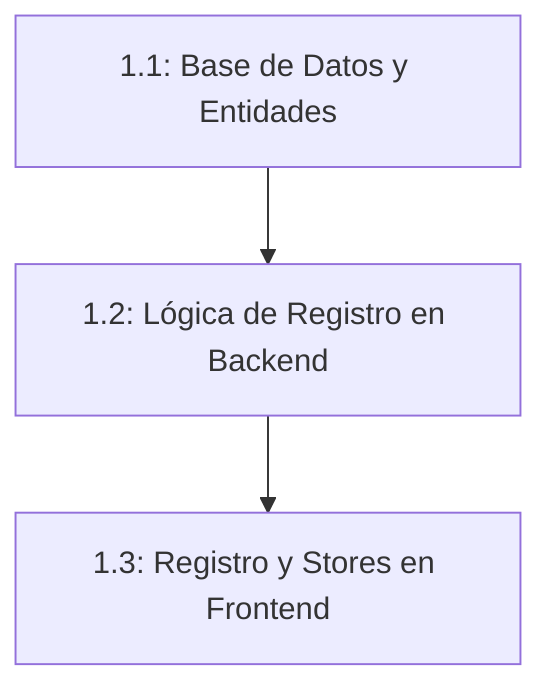

# Plan de Implementación Detallado: Módulo 1
## Infraestructura Base, Ampliación del Modelo de Datos y Perfiles

Este plan subdivide el Módulo 1 en tareas granulares, lógicas y fácilmente testeables para que podamos ejecutarlas paso a paso y verificar su funcionamiento antes de avanzar.

---

## checklist de Tareas

### 1.1. Sub-módulo: Base de Datos y Entidades en NestJS
- [ ] **Tarea 1.1.1: Crear archivos de Entidades**
  - Crear `platform-settings.entity.ts` en `src/auth/entities/` o en un nuevo directorio/módulo.
  - Crear `car-wash.entity.ts` y `car-wash-bay.entity.ts` en un nuevo módulo `src/car-washes/entities/`.
  - Crear `admin-subscription.entity.ts` en `src/car-washes/entities/` o `src/auth/entities/`.
  - Crear `service.entity.ts`, `schedule.entity.ts` y `schedule-exception.entity.ts` en `src/car-washes/entities/`.
  - Crear `booking.entity.ts` en un nuevo módulo `src/bookings/entities/`.
  - Crear `report.entity.ts` y `notification.entity.ts` en sus respectivos módulos o entidades.
- [ ] **Tarea 1.1.2: Configurar Relaciones y Registro Global**
  - Modificar `src/users/entities/user.entity.ts` para agregar la relación 1:1 con la entidad `CarWash` (`user.carWash`).
  - Registrar todas las nuevas entidades en el módulo de TypeORM en `src/app.module.ts`.
  - **Prueba de compilación:** Levantar el servidor NestJS en Termux y verificar que compile sin errores y cree las tablas automáticamente en SQLite (`db.sqlite`).

- [ ] **Tarea 1.1.3: Inicialización Automática (Seeding) de Ajustes Globales**
  - Crear un servicio o lógica de inicio (`OnModuleInit` o un script de seed) en NestJS que verifique si la tabla `platform_settings` está vacía.
  - Si está vacía, insertar automáticamente la fila por defecto con `id = 1`, `superadmin_alias = "plataforma.lavados.alias"`, y `subscription_price = 1500.00` (o el precio acordado).
  - **Prueba de Seeding:** Arrancar el servidor y validar mediante consulta o Swagger que exista la configuración con ID = 1.

---

### 1.2. Sub-módulo: Lógica de Registro y Flujo de Negocio (Backend)
- [ ] **Tarea 1.2.1: Registro de Usuarios tipo Admin**
  - Modificar `UsersService.create()` para interceptar si el rol es `UserRole.ADMIN`.
  - Si es `admin`, crear automáticamente el registro asociado en la tabla `car_washes` con `is_active: false` y los campos obligatorios en nulo/valores por defecto.
- [ ] **Tarea 1.2.2: Creación de Bahía por Defecto**
  - En la misma transacción de creación del lavadero, registrar la primera bahía en `car_wash_bays` asociada al nuevo lavadero (`bay_number = 1`, `status = 'free'`).
- [ ] **Tarea 1.2.3: Modificar Respuestas de Autenticación**
  - Modificar el flujo de login (`AuthService`) para asegurar que cuando un usuario de tipo `admin` inicie sesión, el objeto devuelto al cliente y el token JWT contengan la información del lavadero (`carWashId` y `is_active`).
- [ ] **Tarea 1.2.4: Pruebas de Registro y Relación**
  - Probar con una petición HTTP POST a `/users` para crear un nuevo usuario administrador.
  - Verificar en la base de datos SQLite que se hayan creado tres registros vinculados: el usuario en `users`, el lavadero inactivo en `car_washes` y la bahía inicial en `car_wash_bays`.

---

### 1.3. Sub-módulo: Flujo de Registro y Redirecciones (Frontend Svelte 5)
- [ ] **Tarea 1.3.1: Actualizar Formulario de Registro**
  - Agregar una casilla de verificación (checkbox) en el formulario de registro del cliente: *"¿Deseas registrar un lavadero comercial?"*.
  - Al marcarse, el estado del formulario cambia el rol a enviar de `'client'` a `'admin'`.
- [ ] **Tarea 1.3.2: Adaptar el Store de Sesión (`auth-store.svelte.ts`)**
  - Actualizar el store global de autenticación en Svelte 5 para capturar y estructurar la información reactiva del lavadero (`is_active`, `id`) obtenida del login.
- [ ] **Tarea 1.3.3: Layout Superior y Redirecciones**
  - Estructurar el Layout global del frontend para que, al iniciar sesión, si el rol es `admin` y su lavadero tiene `is_active == false`, lo redirija automáticamente e impida su navegación (esto prepara el Módulo 2).
- [ ] **Tarea 1.3.4: Prueba Visual de Flujo Completo**
  - Registrar un administrador desde la interfaz del navegador.
  - Verificar que el login sea correcto, que se guarde la sesión en el store y que la interfaz responda al estado inactivo.
